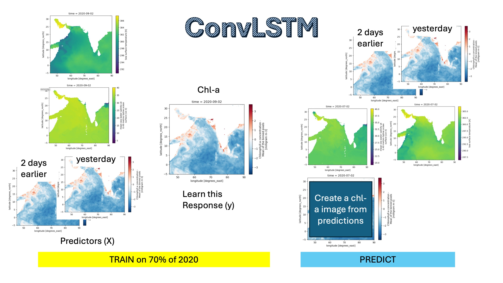

# ConvLSTM

Our data are a time series of images and it would be good to use that time information and prior days' observations of Chlorophyll-a to help use make predictions. The idea is similar to the simple CNN except that we add the prior days. Mathematically it is more complicated since we do not include the prior days as independent variables; we take into account that the information in consecutive days is correlated.

This type of model is what we will want to use to make predictions when we have the day from prior days available. We want to take that data into account since today is likely to be similar to yesterday. 

## Prepping the data

## Modeling fitting, validation and testing

The model steps are the same as for the Simple CNN example.

Once we have the data in the right form, we pass our model fitting function the training data sets `X_train` (predictors) and `y_train` (response or what we are trying to learn). During training, we learn the parameters.

During the validation step, we will run a loop to improve our hyperparameters (structure of our model) using the `X_val` and `y_val` that were not used in training. The result is our 'best' model.

Finally, during the test step, we use our best model to make predictions for the days that it has never 'seen' (the test data). It will use the predictors for these test days (`X_test`) to make predictions and then we will compare the predictions to the true values (`y_test`).