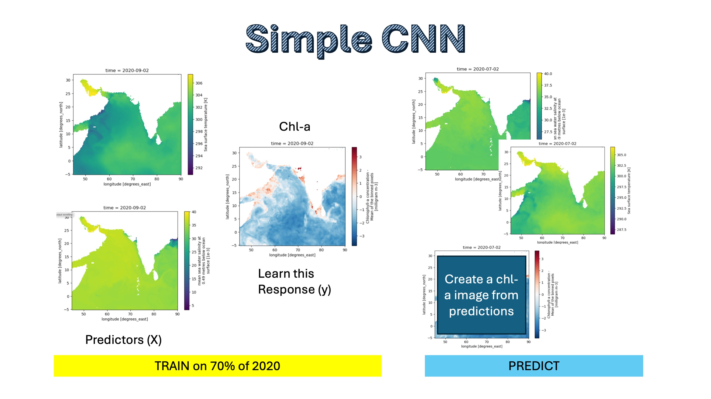

# Simple CNN

In this example, we will attempt to use a Convolutional Neural Network trained on sea surface temperature (sst) and salinity to predict Chlorophyl-a. This is a toy example and won't work very well since sst and salinity do not predict chlorphyll-a all that well. But it will show you the steps involved: prep data into xarray objects used for training, validation and testing.

## Prepping the data

There are many data formats you could use, but we are going to use xarrays (a type of data cube). Technically, it is a numpy array with some meta data. Our arrays with have a bounding box (lat/lon), a time dimension, and variables.

We want to create an xarray for the training, validation, and test data:

- `X_train, X_val, X_test`: the predictor variables of the train/validation/test data
- `y_train, y_val, y_test`: the response variables of the train/validation/test data

All the xarrays will have the same lat/lon grid. The `_train` sets will have the same days, the `_val` will have the same days, and the `_test` will have the same days.

## Modeling fitting, validation and testing

Once we have the data in the right form, we pass our model fitting function the training data sets `X_train` (predictors) and `y_train` (response or what we are trying to learn). During training, we learn the parameters.

During the validation step, we will run a loop to improve our hyperparameters (structure of our model) using the `X_val` and `y_val` that were not used in training. The result is our 'best' model.

Finally, during the test step, we use our best model to make predictions for the days that it has never 'seen' (the test data). It will use the predictors for these test days (`X_test`) to make predictions and then we will compare the predictions to the true values (`y_test`).